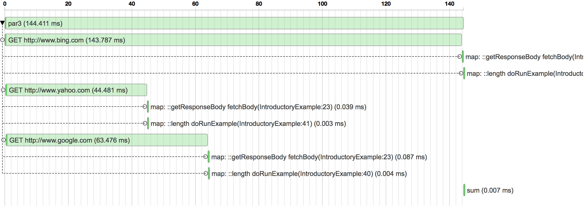
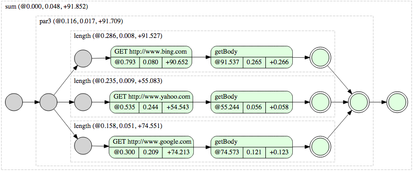

# ParSeq

[](https://opensource.org/licenses/Apache-2.0) [](http://travis-ci.org/linkedin/parseq) [](https://bintray.com/linkedin/maven/parseq/_latestVersion)

ParSeq is a framework that makes it easier to write asynchronous code in Java.

Some of the key benefits of ParSeq include:

* [Parallelization of asynchronous operations (such as IO)](https://github.com/linkedin/parseq/wiki/User%27s-Guide#parallel-composition)
* [Serialized execution for non-blocking computation](https://github.com/linkedin/parseq/wiki/User%27s-Guide#transforming-tasks)
* [Code reuse via task composition](https://github.com/linkedin/parseq/wiki/User%27s-Guide#composiing-tasks)
* [Simple error propagation and recovery](https://github.com/linkedin/parseq/wiki/User%27s-Guide#handling-errors)
* [Execution tracing and visualization](https://github.com/linkedin/parseq/wiki/Tracing)
* [Batching of asynchronous operations](https://github.com/linkedin/parseq/tree/master/subprojects/parseq-batching)
* [Tasks with retry policy](https://github.com/linkedin/parseq/wiki/User%27s-Guide#retrying)

[Our Wiki](https://github.com/linkedin/parseq/wiki) includes an introductory example, a User's Guide, javadoc, and more.

See [CHANGELOG](https://github.com/linkedin/parseq/blob/master/CHANGELOG.md) for list of changes.

## Introductory Example

In this example we show how to fetch several pages in parallel and how to combine them once they've all been retrieved.

You can find source code here: [IntroductoryExample](https://github.com/linkedin/parseq/tree/master/subprojects/parseq-examples/src/main/java/com/linkedin/parseq/example/introduction/IntroductoryExample.java).

First we can retrieve a single page using an [asynchronous HTTP client](https://github.com/linkedin/parseq/tree/master/subprojects/parseq-http-client) as follows:

```java
    final Task<Response> google = HttpClient.get("http://www.google.com").task();
    engine.run(google);
    google.await();
    System.out.println("Google Page: " + google.get().getResponseBody());
```

This will print:

```
Google Page: <!doctype html><html>...
```

In this code snippet we don't really get any benefit from ParSeq. Essentially we create a task that can be run asynchronously, but then we block for completion using `google.await()`. In this case, the code is more complicated than issuing a simple synchronous call. We can improve this by making it asynchronous:

```java
    final Task<String> google = HttpClient.get("http://www.google.com").task()
        .map(Response::getResponseBody)
        .andThen(body -> System.out.println("Google Page: " + body));

    engine.run(google);
```

We used `map` method to transform `Response` into the `String` and `andThen` method to print out result.
Now, let's expand the example so that we can fetch a few more pages in parallel.
First, let's create a helper method that creates a task responsible for fetching page body given a URL.

```java
    private Task<String> fetchBody(String url) {
      return HttpClient.get(url).task().map(Response::getResponseBody);
    }
```

Next, we will compose tasks to run in parallel using `Task.par`.

```java
    final Task<String> google = fetchBody("http://www.google.com");
    final Task<String> yahoo = fetchBody("http://www.yahoo.com");
    final Task<String> bing = fetchBody("http://www.bing.com");

    final Task<String> plan = Task.par(google, yahoo, bing)
        .map((g, y, b) -> "Google Page: " + g +" \n" +
                          "Yahoo Page: " + y + "\n" +
                          "Bing Page: " + b + "\n")
        .andThen(System.out::println);

    engine.run(plan);
```

This example is fully asynchronous. The home pages for Google, Yahoo, and Bing are all fetched in parallel while the original thread has returned to the calling code. We used `Tasks.par` to tell the engine to parallelize these HTTP requests. Once all of the responses have been retrieved they are transformed into a `String` that is finally printed out.

We can do various transforms on the data we retrieved. Here's a very simple transform that sums the length of the 3 pages that were fetched:

```java
    final Task<Integer> sumLengths =
        Task.par(google.map(String::length),
                 yahoo.map(String::length),
                 bing.map(String::length))
             .map("sum", (g, y, b) -> g + y + b);
```

The `sumLengths` task can be given to an engine for execution and its result value will be set to the sum of the length of the 3 fetched pages.

Notice that we added descriptions to tasks. e.g. `map("sum", (g, y, b) -> g + y + b)`. Using ParSeq's [trace visualization tools](https://github.com/linkedin/parseq/wiki/Tracing) we can visualize execution of the plan.
Waterfall graph shows tasks execution in time (notice how all GET requests are executed in parallel):



Graphviz diagram best describes relationships between tasks:



For more in-depth description of ParSeq please visit [User's Guide](https://github.com/linkedin/parseq/wiki/User's-Guide).

For many more examples, please see the [parseq-examples](https://github.com/linkedin/parseq/tree/master/subprojects/parseq-examples) contrib project in the source code.

## Build

Build and test whole parseq code `./gradlew clean build`

Build ParSeq subproject(modules) instead of the whole project:
`./gradlew :<module_name>:build`

Building on MacOS Catalina (>=10.15): Follow [this guide](https://github.com/nodejs/node-gyp/blob/master/macOS_Catalina.md) to install the required Xcode Command Line Tools and add below environment variables
```shell script
export LDFLAGS="-mmacosx-version-min=10.13"
export CXXFLAGS="-mmacosx-version-min=10.13"
```

