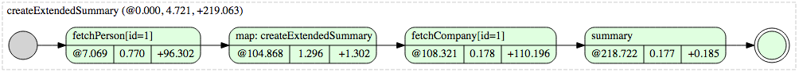
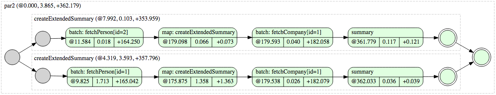

ParSeq Batching
==========================

Often, especially when IO is involved, it is more efficient to perform operations in batches rather than individually. This is the reason why many APIs provide a "batch" version of an operation e.g. [BATCH_GET](https://github.com/linkedin/rest.li/wiki/Rest.li-User-Guide#batch_get) in [Rest.li](http://rest.li/) framework. Typically for optimal efficiency everything that can be batched should be batched.

Unfortunately batching things together may be difficult because instead of working with a single item we need to think about all other places where similar items are used and somehow combine all usages to leverage batching. This breaks modularity, adds complexity and leads to a tradeoff between efficiency and simplicity.

ParSeq Batching provides a mechanism through which asynchronous operations are automatically batched. It can be used to implement efficient "batching clients" where "client" means on object that given ```K key``` provides a task that returns ```T value```.

Example
=======

We have two methods that return tasks returning a Person and Company object given their id:

```java
public Task<Person> fetchPerson(int id) { /* ... */ }
public Task<Company> fetchCompany(int id) { /* ... */ }
```

We would like to write a method that given a person id will return a short description e.g. "John Smith working at LinkedIn". With ParSeq we would write the following code:

```java
// create extended summary for a person: "<first name> <last name> working at <company name>"
Task<String> createExtendedSummary(int id) {
  return fetchPerson(id)
      .flatMap("createExtendedSummary", this::createExtendedSummary);
}

Task<String> createExtendedSummary(final Person p) {
  return fetchCompany(p.getCompanyId())
      .map("summary", company -> shortSummary(p) + " working at " + company.getName());
}

String shortSummary(Person p) {
  return p.getFirstName() + " " + p.getLastName();
}
```

Running ```createExtendedSummary(1)``` task and visualizing it using [ParSeq tracing](https://github.com/linkedin/parseq/wiki/Tracing) will generate the following diagram:



Now suppose that we need to create a summary for two Persons. The most obvious solution would be to write:

```java
Task.par(createExtendedSummary(1), createExtendedSummary(2));
```

Diagram representing execution of above code:


We have four individual fetch operations. If there was a batch fetch available for Person and Company then we would be able to implement batching-aware method that would leverage batch API. We would not be able to simply reuse existing code. With ParSeq Batching an execution of above code would generate the following trace:



Notice that descriptions of fetching tasks have been prefixed with "batch:". This is a hint that those tasks participated in batched operations. In order to see details select "System hidden" option in Trace Viewer:


Only two fetch operation were executed. First operation fetched Persons with ids 1 and 2. Task with description "batch(2)" represents an actual operation. Since both Persons have a reference to Company with Id 1 they have been de-duplicated and in effect single fetch Company operation have been executed. This is represented by task with description "batch(1)".

How to use ParSeq Batching
==========================

In order to use ParSeq Batching we need to set ```BatchingSupport``` as a ```PlanDeactivationListener``` to the ```Engine```:

```java
final BatchingSupport _batchingSupport = new BatchingSupport();
engineBuilder.setPlanDeactivationListener(_batchingSupport);
```

To integrate an asynchronous API with ParSeq Batching we need to implement an instance of a ```BatchingStrategy``` and register it with the ```BatchingSupport``` (we will cover implementation of ```BatchingStrategy``` in next section):

```java
MyBatchingStrategy myBatchingStrategy = new MyBatchingStrategy();
_batchingSupport.registerStrategy(myBatchingStrategy);
```

BatchingStrategy
================

```BatchingStrategy``` allows building "batching clients" where "client" means an object that given ```K key``` provides a task that returns ```T value```. ```BatchingStrategy``` defines which keys can be grouped together into batches and how batches are executed.

```BatchingStrategy``` class has 3 type parameters:
* ```<G>``` Type of a Group,
* ```<K>``` Type of a Key,
* ```<T>``` Type of a Value,

Actual types will depend on specific use case.

```BatchingStrategy``` class declares 2 abstract methods:
* ```G classify(K key)``` - specifies what keys will be grouped together to form a batch,
* ```void executeBatch(G group, Batch<K, T> batch)``` - executes batch and must ensure that all ```Promise``` contained in a given ```Batch``` eventually will be completed

```BatchingStrategy``` has one more method worth mentioning: ```String getBatchName(G group, Batch<K, T> batch)```. It allows to provide a description for a task that executes a batch. By default it is equal to ```"batch(" + batch.size() + ")"```.

Example
=======

Assuming that we have an async API for fetching a Person by id we will create a ParSeq client that will perform batching automatically:
```java
public interface AsyncPersonClient {
  CompletableFuture<Person> get(Long id);
  CompletableFuture<Map<Long, Person>> batchGet(Collection<Long> ids);
}
```
For simplicity we will assume that all individual ```get``` operations can be grouped together. In this example we assume that async client is using Java ```CompletableFuture``` but our code would look very similar if we had to deal with other async mechanisms e.g. callbacks.


```ParSeqPersonClient``` will use ```AsynPersonClient``` internally and will implement ```SimpleBatchingStrategy```:
```java
public class ParSeqPersonClient extends SimpleBatchingStrategy<Long, Person> {
  private final AsyncPersonClient _client;
  public ParSeqPersonClient(AsyncPersonClient client) {
    _client = client;
  }
  // ...
}
```

Since we can group all individual ```get``` into one batch we used ```SimpleBatchingStrategy```. If we had to create multiple batches then we would extend more general ```BatchingStrategy``` that would allow us to declare ```classify``` function that would determine how many batches are created. ```SimpleBatchingStrategy``` class declare a trivial ```classify``` function that groups all keys into one group.

To execute batch we call async ```batchGet``` method and complete ParSeq promises once result is known. All promises belonging to the batch have to be resolved with either successful result or a failure. Leaving any of the promises unresolved may lead to plan that remains uncompleted forever.
```java
  @Override
  public void executeBatch(Batch<Long, Person> batch) {
    _client.batchGet(batch.keys()).whenComplete((results, exception) -> {
      if (exception != null) {
        // batch operation failed so we need to fail all promises
        batch.failAll(exception);
      } else {
        // complete promises with values from results
        batch.foreach((key, promise) -> promise.done(results.get(key)));
      }
    });
  }
```

Finally we need to define main API for our ```ParSeqPersonClient```:
```java
  public Task<Person> get(Long id) {
    return batchable("fetch Person " + id, id);
  }
```
```batchable()``` method is declared by a ```BatchingStrategy``` and returns a task that cooperates with a batching strategy to performa a batchable operation.

Source code for above example can be found [here](https://github.com/linkedin/parseq/blob/master/contrib/parseq-examples/src/main/java/com/linkedin/parseq/example/domain/ParSeqPersonClient.java).

Task-based BatchingStrategy
===========================

```BatchingStrategy``` API is intended to be used when integrating asynchronous API (e.g. based on callbacks or ```CompletableFuture``` ) with parseq. It is not convenient to use when we have an existing parseq API. In those cases we can use ```TaskBasedBatchingStrategy```.

```TaskBasedBatchingStrategy``` class has 3 type parameters:
* ```<G>``` Type of a Group,
* ```<K>``` Type of a Key,
* ```<T>``` Type of a Value,

Actual types will depend on specific use case.

```TaskBasedBatchingStrategy``` class declares 2 abstract methods:
* ```G classify(K key)``` - specifies what keys will be grouped together to form a batch,
* ```Task<Map<K, Try<T>>> taskForBatch(G group, Set<K> keys)``` - returns a ```Task``` that given set of keys return a map containing successful result or a failure for every key.

```TaskBasedBatchingStrategy``` has one more method worth mentioning: ```String getBatchName(G group, Set<K> key)```. It allows to provide a description for a task that executes a batch. By default it is equal to ```"batch(" + keys.size() + ")"```.

For a simple case when all keys can always be grouped into a batch there exists a ```SimpleTaskBasedBatchingStrategy``` that requires only one method to be declared: ```Task<Map<K, Try<T>>> taskForBatch(Set<K> keys)```.
